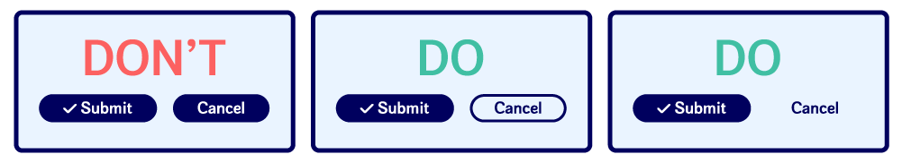
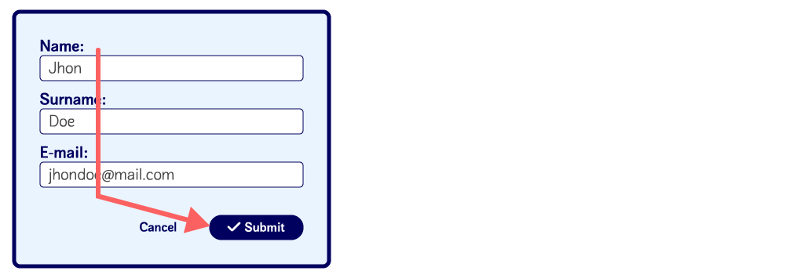
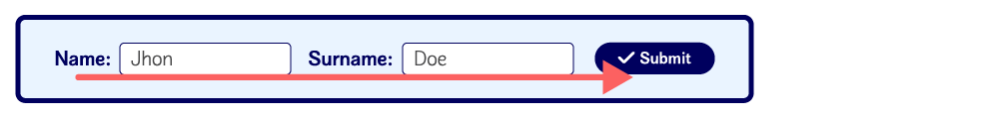

# Submit Button

A Submit button is a primary kind of button. Use it for either submitting or sending information on a form, or accepting terms on a prompted message.

## Installation

To install and save it in your package.json dependencies, run the command below npm:

```
npm install nds-assignment
```

or, if you are using yarn:

```
yarn add nds-assignment
```

and then import the component into your project:

```
import * as React from 'react';
import ReactDOM from 'react-dom';
import { SubmitButton } from 'nds-assignment';

function App() {
  return <SubmitButton />;
}
```

## Type modifiers

The submit button component comes in two different variants: `Default` and `Inverted`

### Default

Use this button when the background is lighter (`color-bg1`, `color-bg2`, `color-bg3` or light mode).

As its name states, this type will be provided by default so there is no need to specify the type.

```
<SubmitButton />
```

_This will return a medium-sized default button_

### Inverted

Use this button when the background is darker than the content (dark mode).

To change the variant of the button, use the `type` attribute.

```
<SubmitButton type="inverted" />
```

## Size modifiers

The submit button component comes in three different sizing options: `small`, `medium` and `large`.

Use them minding carefully both the size of your master component and the size of the viewport you are targeting.

The default size variant is `medium`

To change the size of the button, use the `size` attribute.

```
<SubmitButton size="small" />
```

or

```
<SubmitButton size="large" />
```

Use the small button for portrait views in small devices (mobile).

Use the large button for larger desktop screens.

## Handling clicks

Use the `onButtonClick` handler to pass the function the button will trigger when pressed.

```
const myFunction = () => {
    console.log("Pressed");
}
```

...

```
<SubmitButton onButtonClick={myFunction} />
```

## Disabling buttons

To disable the button just add the `disabled` attribute.

```
<SubmitButton disabled />
```

## Correct usage

Never use more than one Submit button on the same view.

The submit button is a primary button that should trigger ONLY the desired action.

To add new actions use instead a secondary button or a plain text button.



## Placement

Place the button in the users’ reading pattern according to the flow of your form.

### Vertical flow (Z-flow / F-flow)



### Horizontal flow



## Accessibility

-   Use always the corresponding variant according to the background color in order to maintain a correct contrast ratio.

-   Use the adequate size according to the viewport you're targeting or the size of your master component to make it reachable.

-   Make sure the submit button is the last element on your tabulation order.
